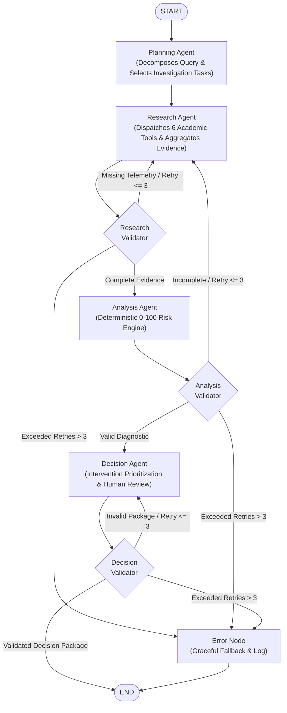
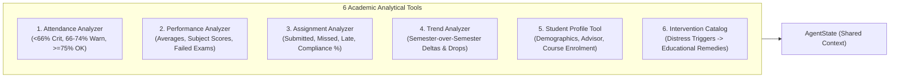
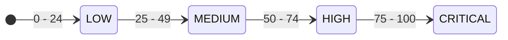
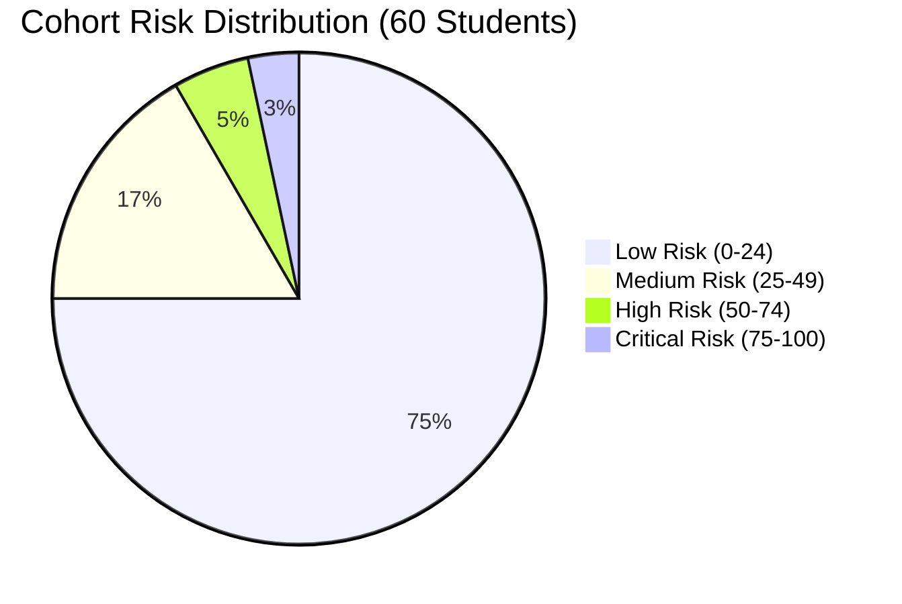
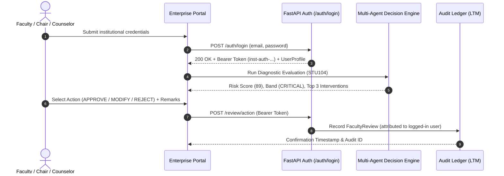
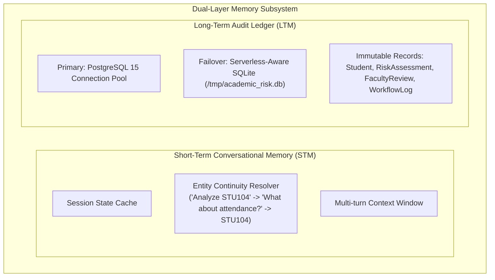

# Internship Technical Dossier & Project Completion Report
## AI Agent Coordination & Decision Engine
### AI Academic Early-Warning & Intervention Decision Engine

---

> [!NOTE]
> **Internship Project Profile**  
> **Student / Intern Name**: PRASANNA RAJ K  
> **Official Project Title**: AI Agent Coordination & Decision Engine  
> **Domain**: Agentic AI, Multi-Agent Coordination, Educational Data Mining, Full-Stack AI Engineering  
> **Repository**: [github.com/Prasannaraj2k5/ai-academic-risk-engine-multi-agent-coordination](https://github.com/Prasannaraj2k5/ai-academic-risk-engine-multi-agent-coordination)  
> **Live Cloud Deployment**: [ai-academic-risk-engine-multi-agent.vercel.app](https://ai-academic-risk-engine-multi-agent.vercel.app/)  
> **Software License**: MIT License (Copyright (c) 2026 PRASANNA RAJ K)  
> **Version**: 2.0.0 (Enterprise-Oriented Prototype)

---

## 1. Executive Summary & Problem Definition

In contemporary higher education ecosystems, institutions grapple with student retention attrition caused primarily by delayed identification of academic vulnerability. Traditional academic monitoring relies upon lagging indicators—such as mid-semester grade sheets or end-of-term transcripts—by which point pedagogical remediation options are severely constrained.

Furthermore, faculty advisors are burdened with fragmented telemetry across siloed attendance logs, learning management system (LMS) assignments, internal examination marks, and historical counseling records.

### Core Objectives
1. **Multi-Agent Coordination**: Design a cyclic, state-driven multi-agent framework utilizing LangGraph where autonomous agents coordinate to investigate, evaluate, and formulate interventions.
2. **Deterministic Risk Computation**: Guarantee zero generative hallucinations by computing student risk scores strictly in Python using deterministic, rule-based algorithms.
3. **Evidence-Based Remediation**: Automatically cross-reference diagnostic academic triggers against an institutional intervention catalog.
4. **Human-in-the-Loop Governance**: Provide an interactive faculty decision portal where faculty advisors review, adjust, and approve recommended interventions prior to institutional enactment.
5. **Dual-Layer Memory**: Support conversational context continuity across advising turns (Short-Term Memory) while maintaining a persistent institutional audit ledger (Long-Term Memory).

---

## 2. Multi-Agent System Architecture

The engine coordinates four specialized agents structured within a bounded LangGraph `StateGraph`:

### Agent Roles and Responsibilities

| Agent Name | Architectural Role | Core Capabilities | Safe Fallback Behavior |
| :--- | :--- | :--- | :--- |
| **Planning Agent** | Task Decomposer | Identifies target student IDs or cohort scope; maps necessary tools | Generates structured task checklists without calculating scores |
| **Research Agent** | Evidence Aggregator | Dispatches 6 academic analytical tools; collates longitudinal data | Pulls verified synthetic datasets from CSV/JSON stores |
| **Analysis Agent** | Deterministic Risk Engine | Strictly computes numerical scores (0–100) across 5 components in Python | Prevents LLM numerical hallucinations |
| **Decision Agent** | Action Formulator | Prioritizes top 3 interventions; assigns urgency & review deadlines | Assembles structured human-in-the-loop review package |

---

## 3. Specialized Academic Analytical Tools

Six specialized tools collect, normalize, and evaluate academic telemetry:

1. **Attendance Analyzer (`tools/attendance_analyzer.py`)**: Computes overall and subject-level attendance percentages; classifies attendance bands into *Critical* (`<66%`), *Warning* (`66–74.9%`), or *Acceptable* (`>=75%`).
2. **Performance Analyzer (`tools/performance_analyzer.py`)**: Calculates current semester average across 5 courses and identifies subjects with failed internal examinations (`<50%`).
3. **Assignment Analyzer (`tools/assignment_analyzer.py`)**: Quantifies deliverables across 20 assignments, tracking submitted, late, and missed deliverables alongside submission compliance percentage.
4. **Trend Analyzer (`tools/trend_analyzer.py`)**: Compares prior semester performance (e.g. 74.0%) against current semester average (e.g. 54.7%) to identify precipitous academic declines (`>15%` drop).
5. **Student Profile Tool (`tools/student_profile.py`)**: Retrieves unified demographic, departmental, semester, and academic advisor profiles.
6. **Intervention Knowledge Base (`tools/intervention_knowledge.py`)**: Rules-based repository mapping diagnosed failure triggers directly to prioritized educational interventions.

---

## 4. Deterministic Risk Engine & Mathematical Formulation

> [!IMPORTANT]
> **Zero LLM Calculation Rule**  
> To guarantee mathematical precision, explainability, and regulatory compliance, the risk score is **never calculated by a language model**. The LLM produces qualitative rationale based strictly on Python-calculated components.

### 5-Component Risk Model (0 – 100 Scale)

$$\text{Composite Risk Score} = P_{\text{perf}} + A_{\text{att}} + S_{\text{asn}} + E_{\text{exam}} + H_{\text{hist}}$$

| Component | Max Points | Evaluation Algorithm |
| :--- | :---: | :--- |
| **Performance ($P_{\text{perf}}$)** | **30** | Points assigned based on current grade average: $<50\% \rightarrow 30$, $50-59\% \rightarrow 25$, $60-69\% \rightarrow 15$, $70-79\% \rightarrow 5$, $\ge 80\% \rightarrow 0$. |
| **Attendance ($A_{\text{att}}$)** | **25** | Overall attendance percentage: $<60\% \rightarrow 25$, $60-65.9\% \rightarrow 20$, $66-74.9\% \rightarrow 15$, $75-84.9\% \rightarrow 5$, $\ge 85\% \rightarrow 0$. |
| **Assignments ($S_{\text{asn}}$)** | **20** | Missed deliverable penalty ($5\text{ pts/miss}$, max 10) $+$ Late deliverable penalty ($2\text{ pts/late}$, max 6) $+$ Low completion rate penalty ($<75\% \rightarrow 4$). |
| **Assessments ($E_{\text{exam}}$)** | **15** | Failed assessments ($<50\%$ in midterm/exam): $5\text{ pts}$ per failed assessment, capped at 15 points. |
| **History ($H_{\text{hist}}$)** | **10** | Historical risk records: Prior academic warning ($5\text{ pts}$) $+$ Prior semester probation ($5\text{ pts}$). |

### Institutional Risk Bands

- **LOW (0 – 24)**: Standard advising; routine semester check-ins.
- **MEDIUM (25 – 49)**: Academic warning; peer tutoring recommendations; advisor check-in within 30 days.
- **HIGH (50 – 74)**: Elevated vulnerability; remedial subject tutorials; parent notification; check-in within 14 days.
- **CRITICAL (75 – 100)**: Immediate failure risk; mandatory faculty counseling; personalized remediation contract; review within 7 days.

### Verified Demonstration Subject: Student STU104 (Rohan Verma)

| Diagnostic Metric | Empirical Value | Assigned Points | Maximum | Verification Status |
| :--- | :---: | :---: | :---: | :---: |
| **Current Grade Average** | 54.7% | **30** | 30 | Pass |
| **Overall Attendance** | 68.0% | **25** | 25 | Pass |
| **Assignment Compliance** | 2 missed, 4 late (90.0% completion) | **17** | 20 | Pass |
| **Failed Assessments** | 2 subjects $< 50\%$ | **10** | 15 | Pass |
| **Historical Precedent** | Prior Academic Warning in Sem 4 | **7** | 10 | Pass |
| **Total Composite Score** | **CRITICAL** | **89 / 100** | **100** | **Verified** |

---

## 5. Cohort Analysis & Triage Validation (Section CSE-A)

The engine was evaluated across the entire 60-student cohort of Section CSE-A (300 academic records, 1,200 assignments). The deterministic batch pipeline produced the exact planned distribution:

| Risk Tier | Score Band | Cohort Count | Distribution % | Sample Student IDs |
| :--- | :---: | :---: | :---: | :--- |
| **CRITICAL** | 75 – 100 | **2** | 3.3% | `STU104`, `STU112` |
| **HIGH** | 50 – 74 | **3** | 5.0% | `STU118`, `STU125`, `STU139` |
| **MEDIUM** | 25 – 49 | **10** | 16.7% | `STU107`, `STU115`, `STU121`, `STU128`, etc. |
| **LOW** | 0 – 24 | **45** | 75.0% | `STU101`, `STU102`, `STU103`, `STU105`, etc. |
| **Total** | | **60** | **100%** | **Entire CSE-A Cohort** |

---

## 6. Institutional Security & Authentication Portal

To guarantee audit accountability and institutional access control, a role-based authentication portal gates access to the decision engine:

### Pre-Configured Demonstration Accounts

| Role | Authorized User | Institutional Email | Demo Password | Scope of Authority |
| :--- | :--- | :--- | :--- | :--- |
| **Faculty Academic Advisor** | Dr. K. Raman | `dr.raman@academics.edu` | `faculty2026` | Cohort advisement, intervention approval, counseling notes |
| **Department Chair & Dean** | Dr. S. Mehta | `chair@academics.edu` | `admin2026` | Cohort administrative governance, curriculum policy alerts |
| **Lead Academic Counselor** | Ms. Priya Nair | `counselor@academics.edu` | `counselor2026` | Psycho-social wellness interventions, attendance remediation |

---

## 7. Dual-Layer Memory Architecture

- **Short-Term Memory (`memory/short_term_memory.py`)**: Tracks conversational turns and automatically resolves pronoun/entity references across questions without repeating student IDs.
- **Long-Term Memory (`memory/long_term_memory.py`)**: Persists risk assessments and faculty actions into relational tables with automatic SQLite fallback when PostgreSQL is unreachable.

---

## 8. Verification & Performance Benchmark Results

### 1. Automated Test Suite (30 / 30 Passed)
- `tests/test_agents.py`: Verified Planning, Research, Analysis, Decision, and Base agents (5/5 passed).
- `tests/test_tools.py`: Verified Attendance, Performance, Assignment, Trend, Profile, and Knowledge Base tools (6/6 passed).
- `tests/test_workflow.py`: Verified LangGraph state transitions, router retry thresholds, STU104 execution, and cohort distribution (5/5 passed).
- `tests/test_memory.py`: Verified short-term conversational resolution and long-term database persistence (2/2 passed).
- `tests/test_api.py`: Verified all REST endpoints including `/health`, `/ask`, `/students/analyze`, `/class/analyze`, `/workflow/run`, `/review/action`, and `/auth/login` (12/12 passed).

### 2. 23-Point System Audit Checklist (23 / 23 Passed)
- All 23 architectural audit criteria (reusable agents, deterministic scoring, secret protection, error resilience, retry bounds, Docker composition) were verified and recorded.

### 3. Real Performance Benchmark Telemetry

| Benchmark Operation | Measured Mean Latency | Throughput / Efficiency |
| :--- | :---: | :--- |
| **Tool Execution (Mean across 6 tools)** | **3.41 ms** | Instantaneous telemetry extraction |
| **Short-Term Entity Resolution** | **0.019 ms** | Zero conversational overhead |
| **Relational Database Query (ORM)** | **0.904 ms** | Sub-millisecond lookup |
| **Full LangGraph Workflow Execution** | **183.02 ms** | Complete 4-agent coordination cycle |
| **Cohort Batch Triage (60 Students)** | **1,064.62 ms** | **17.7 ms / student** batch velocity |
| **Concurrent REST Queries (10 threads, 30 req)** | **29.44 ms avg** | **303.0 requests / second** |

---

## 9. Technology Stack Summary

| Architectural Layer | Technologies & Frameworks Employed |
| :--- | :--- |
| **Agent Orchestration** | LangGraph (Cyclic StateGraph), LangChain Core |
| **Language Model Integration**| ChatGroq (`llama-3.3-70b-versatile`) with safe deterministic fallback |
| **REST API Framework** | FastAPI, Starlette, Pydantic v2 |
| **Database & Persistence** | PostgreSQL 15 (Production), SQLAlchemy 2.0 ORM, SQLite 3 (Fallback) |
| **Frontend Dashboard** | Vanilla JavaScript (ES6+), Modern HTML5, Responsive CSS3 Grid/Flexbox |
| **DevOps & Containerization** | Docker, Docker Compose, Git, Vercel Serverless Functions, Edge CDN |
| **Testing & Quality Assurance** | Pytest 9.x, Starlette TestClient, Custom Audit Automation |

---

## 10. Key Learnings & Engineering Takeaways

1. **Deterministic vs. Generative Boundary**: LLMs excel at qualitative rationale and natural language explanation, but must never be entrusted with unconstrained numerical risk scoring. Enforcing deterministic Python calculations produces explainable, reproducible, and trustworthy AI.
2. **State-Driven Multi-Agent Coordination**: Utilizing LangGraph's typed `AgentState` with conditional routing and retry bounds prevents infinite agent loops while maintaining structured execution traces.
3. **Resilient Cloud & Serverless Deployment**: Serverless cloud environments (such as Vercel AWS Lambda) enforce read-only filesystems. Designing dynamic storage paths (`/tmp` fallback) and decoupling file-serving from external streaming libraries ensures zero-downtime deployment.
4. **Human-in-the-Loop Governance**: Decision-support systems must empower human experts rather than replace them. Providing structured Approve/Modify/Reject workflows establishes institutional trust and clear accountability.
