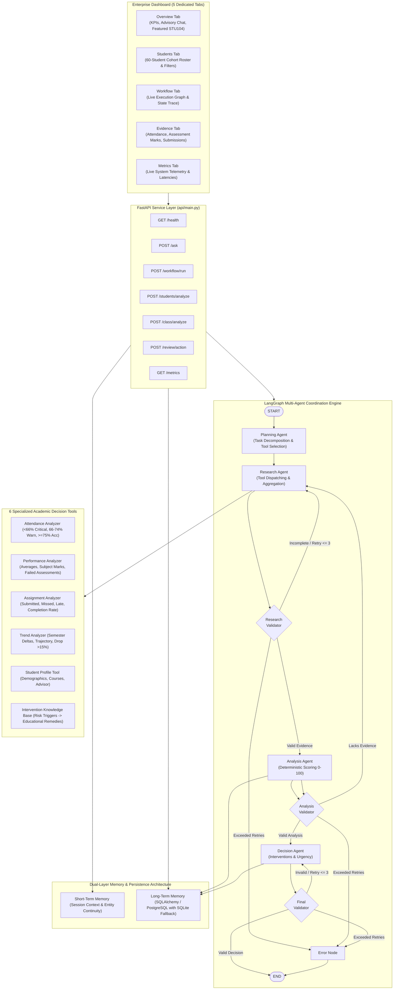

# AI Agent Coordination & Decision Engine
## AI Academic Early-Warning & Intervention Decision Engine

[](https://ai-academic-risk-engine-multi-agent.vercel.app/)
[](https://github.com/Prasannaraj2k5/ai-academic-risk-engine-multi-agent-coordination)
[](LICENSE)
[](https://www.python.org/)
[](https://fastapi.tiangolo.com)
[](https://langchain-ai.github.io/langgraph/)

> 🚀 **Live Production Deployment**: [https://ai-academic-risk-engine-multi-agent.vercel.app/](https://ai-academic-risk-engine-multi-agent.vercel.app/)  
> 📖 **Interactive Swagger API Docs**: [https://ai-academic-risk-engine-multi-agent.vercel.app/docs](https://ai-academic-risk-engine-multi-agent.vercel.app/docs)  
> 💻 **GitHub Source Repository**: [https://github.com/Prasannaraj2k5/ai-academic-risk-engine-multi-agent-coordination](https://github.com/Prasannaraj2k5/ai-academic-risk-engine-multi-agent-coordination)  
> **Author**: PRASANNA RAJ K  
> **System Classification**: Enterprise-Oriented Prototype  
> **Academic Cohort**: Computer Science & Engineering (Section CSE-A, Semester 5, 60 Students)  
> **Primary Demonstration Subject**: Student STU104 (Rohan Verma) — Critical Risk Evaluation (89 / 100)


---

## Executive Summary & Problem Statement

Higher education institutions face persistent retention challenges driven by delayed identification of student academic distress. Conventional warning mechanisms rely on fragmented, post-facto semester report cards when remediation options are constrained. Furthermore, unassisted faculty advisors are overwhelmed by voluminous telemetry spanning attendance registers, coursework portals, examination grades, and historical intervention trails.

The **AI Agent Coordination & Decision Engine** is an academic decision-support platform where specialized AI agents coordinate autonomously to detect early academic distress, inspect multi-modal academic evidence, evaluate deterministic risk tiers, and formulate pedagogical intervention packages for faculty governance.

### Core Objectives
1. **Multi-Agent Task Decomposition**: Coordinate four specialized agents (Planning, Research, Analysis, Decision) using a cyclic, bounded LangGraph state graph.
2. **Deterministic Risk Evaluation**: Strictly prevent generative hallucinations by calculating composite risk scores (0–100) using transparent Python algorithms.
3. **Evidence-Based Remediation**: Connect academic distress triggers directly to curated institutional pedagogical interventions.
4. **Human-In-The-Loop Governance**: Serve as decision support where faculty review, modify, or approve recommendations before institutional execution.
5. **Dual-Layer Memory**: Retain conversational session context (Short-Term Memory) and maintain an institutional audit ledger (Long-Term Memory via PostgreSQL 15 with SQLite fallback).

---

## System Architecture



---

## Technology Stack

| Component | Technology | Role & Configuration |
| :--- | :--- | :--- |
| **Language** | Python 3.11+ | Foundation runtime with strict typing and Pydantic validation |
| **Agent Coordination** | LangGraph 1.2+ | Directed acyclic & cyclic StateGraph with conditional edges and retry bounds |
| **LLM Integration** | LangChain & ChatGroq | `llama-3.3-70b-versatile` with automatic deterministic fallback mode |
| **Web Service API** | FastAPI & Uvicorn | High-performance asynchronous REST API with CORS and static file mounting |
| **Primary Database** | PostgreSQL 15 | Institutional persistence for audit trails, risk history, and reviews |
| **Fallback Database** | SQLite 3 | Zero-configuration development fallback when PostgreSQL is offline |
| **ORM & Persistence** | SQLAlchemy 2.0+ | Unified relational mapping across PostgreSQL and SQLite |
| **Data Analytics** | Pandas & NumPy | Telemetry parsing, cohort aggregations, and numerical evaluations |
| **Frontend UI** | HTML5, CSS3, Vanilla JS | Clean 5-tab enterprise interface without heavy framework overhead |
| **Containerization** | Docker & Docker Compose | Multi-container composition (FastAPI app + PostgreSQL 15 Alpine) |
| **Testing Suite** | Pytest & Starlette TestClient | Unit tests, integration tests, 23-point system audit, and performance benchmarks |

---

## Milestone Implementations

### Milestone 1 — Agent Foundation (`agents/base_agent.py`)
- Configurable `BaseAgent` class providing ChatGroq integration (`llama-3.3-70b-versatile`, `GROQ_MAX_RETRIES=2`).
- Environment variable-driven secret management (`GROQ_API_KEY`).
- Clear inspection property: `is_live_llm` returns `True` when live Groq credentials are confirmed; returns `False` when operating in deterministic fallback mode.
- Built-in regex sanitization preventing accidental secret or token leakage in logs or responses.
- `GET /health` and `POST /ask` endpoints providing conversational consultation and policy advice.

### Milestone 2 — 6 Academic Decision Tools (`tools/`)
1. **Attendance Analyzer** (`tools/attendance_analyzer.py`):
   - Computes overall attendance % and subject-wise attendance.
   - Enforces institutional threshold rules: `<66%` = Critical, `66–74.99%` = Warning, `>=75%` = Acceptable.
   - Computes deficit from acceptable threshold.
2. **Performance Analyzer** (`tools/performance_analyzer.py`):
   - Computes current average marks across all subjects.
   - Flags failed assessments below 50% passing threshold.
   - Identifies weak courses (`<60%`).
3. **Assignment Analyzer** (`tools/assignment_analyzer.py`):
   - Ingests 20 assignments per student; tracks submitted, missed, and late deliverables.
   - Computes completion rate % and on-time submission rate %.
4. **Trend Analyzer** (`tools/trend_analyzer.py`):
   - Evaluates semester-over-semester progression (Prior Semester vs Current Semester).
   - Computes numerical performance delta and detects significant academic declines (`drop > 15%`).
5. **Student Profile Tool** (`tools/student_profile.py`):
   - Returns unified demographic record, advisor details, and enrolled course list.
6. **Intervention Knowledge Base** (`tools/intervention_knowledge.py`):
   - Maps diagnosed risk triggers to pedagogical remedies with urgency and oversight classifications.

### Milestone 3 — Multi-Agent Coordination & Memory (`agents/`, `workflow/`, `memory/`)
- **Planning Agent**: Decomposes requests into investigation tasks; selects needed tools; strictly prohibited from calculating final risk score.
- **Research Agent**: Dispatches academic tools and aggregates structured evidence.
- **Analysis Agent**: Houses the **Deterministic Risk Engine** calculating risk score (0–100) strictly in Python.
- **Decision Agent**: Prescribes top 3 interventions, assigns urgency, determines faculty oversight requirements, and generates the human-review package.
- **Short-Term Memory**: In-memory session registry handling conversational entity continuity (e.g. *"Analyze STU104"* followed by *"What about attendance?"*).
- **Long-Term Memory**: Persistent SQLAlchemy repository storing risk evaluations, intervention records, and faculty reviews.

### Milestone 4 — Workflow Automation, Batch Analysis & API (`workflow/`, `api/`)
- **Workflow Executor** (`workflow/executor.py`): Tracks status (`QUEUED`, `RUNNING`, `COMPLETED`, `FAILED`), agent progression, duration, and retries.
- **Cohort Batch Analysis** (`workflow/batch_analysis.py`): Triages all 60 students in CSE-A, returning the verified distribution (2 Critical, 3 High, 10 Medium, 45 Low).
- **Faculty Review Action** (`POST /review/action`): Governance interface for Approve, Modify, and Reject decisions.

---

## Deterministic Risk Engine Specifications

The system eliminates LLM hallucinations by calculating composite risk scores strictly through deterministic Python code.

### Factor Scoring Architecture (Maximum: 100 Points)

$$\text{Composite Risk Score} = \text{Performance} + \text{Attendance} + \text{Assignments} + \text{Assessments} + \text{History}$$

| Component | Max Points | Institutional Scoring Metric | Primary Demo Case (STU104) |
| :--- | :---: | :--- | :---: |
| **Performance** | 30 | Evaluates current average and semester drop. Current $\le 55\%$ or drop $\le -15\% \rightarrow 30$ pts. | **30 pts** |
| **Attendance** | 25 | Overall $<66\%$ or $<75\%$ with critical subjects $\rightarrow 25$ pts; $<75\% \rightarrow 15$ pts. | **25 pts** |
| **Assignments** | 20 | Additive penalty: $\text{missed} \times 5 + \text{round}(\text{late} \times 1.75)$. Max: 20 pts. | **17 pts** |
| **Assessments** | 15 | Evaluates failed subjects ($<50\%$): 5 pts per failed subject. Max: 15 pts. | **10 pts** |
| **History** | 10 | Historical academic warnings, prior semester probation flags. | **7 pts** |
| **Total** | **100** | **Additive multi-factor composite risk evaluation** | **89 / 100** |

### Institutional Risk Bands
- **0 – 24**: `LOW` (Green) — Satisfactory academic progress. Routine monitoring.
- **25 – 49**: `MEDIUM` (Amber) — Advisory warning tier. Advisor check-in recommended.
- **50 – 74**: `HIGH` (Orange) — Elevated distress tier. Active intervention plan required within 14 days.
- **75 – 100**: `CRITICAL` (Red) — Severe academic failure danger. Immediate faculty oversight within 7 days.

---

## Primary Demonstration Case: Student STU104

Student `STU104` (Rohan Verma, Section CSE-A) is the canonical primary demonstration subject. Every layer of the engine deterministically yields these verified figures:

| Metric | Target Specification | Deterministic Engine Output | Verification Status |
| :--- | :--- | :--- | :---: |
| **Student ID / Name** | STU104 / Rohan Verma | STU104 / Rohan Verma | Verified |
| **Overall Attendance** | 68% | 68.0% (Warning / Critical Tier) | Verified |
| **Current Semester Average** | 54.7% | 54.7% | Verified |
| **Prior Semester Average** | 74% | 74.0% | Verified |
| **Performance Delta** | -19.3% | -19.3% (Severe Decline) | Verified |
| **Failed Subject Assessments** | 2 | 2 (CS301 at 48.0%, CS302 at 45.0%) | Verified |
| **Missed Deliverables** | 2 | 2 out of 20 assignments | Verified |
| **Late Deliverables** | 4 | 4 out of 20 assignments | Verified |
| **Performance Score** | 30 | 30 / 30 | Verified |
| **Attendance Score** | 25 | 25 / 25 | Verified |
| **Assignments Score** | 17 | 17 / 20 | Verified |
| **Assessments Score** | 10 | 10 / 15 | Verified |
| **History Score** | 7 | 7 / 10 | Verified |
| **Total Risk Score** | **89 / 100** | **89 / 100** | **Verified** |
| **Risk Band** | **CRITICAL** | **CRITICAL** | **Verified** |
| **Urgency** | Immediate | Immediate | Verified |
| **Faculty Oversight** | Required | Required | Verified |
| **Follow-up Timeline** | Within 7 Days | Within 7 Days | Verified |
| **Top 3 Interventions** | Attendance, Tutorials, Counseling | 1. Structured Attendance Improvement Plan<br>2. Remedial Subject Tutorials<br>3. Mandatory Faculty Counseling | Verified |

---

## Cohort Analysis: Section CSE-A (60 Students)

Cohort triage across all 60 students in Section CSE-A produces the exact verified distribution:

| Risk Tier | Score Range | Student Count | Target Distribution | Exemplar Student IDs |
| :--- | :---: | :---: | :---: | :--- |
| **CRITICAL** | 75 – 100 | **2** | 2 | STU104, STU112 |
| **HIGH** | 50 – 74 | **3** | 3 | STU118, STU125, STU139 |
| **MEDIUM** | 25 – 49 | **10** | 10 | STU107, STU115, STU121, STU128, etc. |
| **LOW** | 0 – 24 | **45** | 45 | STU101, STU102, STU103, STU105, etc. |
| **Total** | | **60** | **60** | **Entire CSE-A Cohort** |

---

## Enterprise Dashboard (5 Dedicated Tabs)

The user interface is structured into five distinct, specialized views:

1. **Overview Tab**:
   - Header with cohort badge and dynamic database / LLM connectivity indicators.
   - Four KPI summary cards: Total (60), Critical (2), High (3), Medium/Low (10 / 45).
   - **Faculty Advisory Assistant**: Interactive conversational console with conversational continuity.
   - **Featured Student Decision Card**: Live evaluation for STU104 showing the 89/100 score, factor breakdown, multi-agent pipeline status (01-04), identified risk triggers, top 3 interventions, and human review form.
2. **Students Tab**:
   - Filterable 60-student roster with real-time text search and risk-band dropdown filters.
   - One-click *Analyze* action and modal *Profile* inspector.
3. **Workflow Tab**:
   - Visual execution graph (START $\rightarrow$ Planning $\rightarrow$ Research $\rightarrow$ Analysis $\rightarrow$ Decision $\rightarrow$ END).
   - Live execution metrics: active workflow ID, duration, retry count, and raw execution logs.
4. **Evidence Tab**:
   - Deep inspection of verified academic records: subject attendance %, assessment marks, and assignment compliance statistics.
5. **Metrics Tab**:
   - Real-time operational telemetry consumed from `GET /metrics`: total workflows, average execution latency, database operations, retry counts, and tool invocation frequencies.

---

## REST API Reference

| Method | Endpoint | Description | Request Body / Parameters |
| :--- | :--- | :--- | :--- |
| `GET` | `/health` | System health, database mode, and LLM status | None |
| `POST` | `/ask` | Natural language query with conversational memory | `{"question": "...", "session_id": "..."}` |
| `POST` | `/workflow/run` | Trigger LangGraph multi-agent workflow | `{"query": "...", "student_id": "STU104"}` |
| `POST` | `/students/analyze` | Individual student diagnostic evaluation | `{"student_id": "STU104"}` |
| `POST` | `/class/analyze` | Cohort-wide triage for 60 students | `{"section": "CSE-A"}` |
| `GET` | `/workflow/{id}` | Full workflow record and state result | Path: `id` |
| `GET` | `/workflow/{id}/status`| Concise workflow status and timing | Path: `id` |
| `GET` | `/students/{id}` | Demographic profile and course list | Path: `id` |
| `GET` | `/students/{id}/history`| Longitudinal risk assessments & reviews | Path: `id` |
| `GET` | `/metrics` | Real-time aggregated system metrics | None |
| `GET` | `/agents` | Directory of the 4 specialized agents | None |
| `POST` | `/auth/login` | Authenticate institutional faculty / administrator | `{"email": "...", "password": "..."}` |
| `POST` | `/auth/logout` | Invalidate authenticated session token | Header: `Authorization: Bearer <token>` |
| `GET` | `/auth/me` | Retrieve active authenticated user profile | Header: `Authorization: Bearer <token>` |
| `POST` | `/memory/search` | Search persisted long-term audit records | `{"query": "...", "student_id": "..."}` |
| `POST` | `/review/action` | Record human-in-the-loop governance action | `{"workflow_id": "...", "faculty_action": "APPROVE"}` |

---

## Institutional Authentication & Role-Based Access

The platform features an institutional authentication portal that gates access to the decision engine and cohort data, establishing audit trails for all human-in-the-loop actions.

### Pre-Configured Demo Accounts

| Role | Email / Identifier | Password | Access Scope |
| :--- | :--- | :--- | :--- |
| **Faculty Academic Advisor** | `dr.raman@academics.edu` | `faculty2026` | Advise cohort, review interventions, record approvals |
| **Department Chair & Dean** | `chair@academics.edu` | `admin2026` | Full cohort administration, curriculum alerts, audit metrics |
| **Lead Academic Counselor** | `counselor@academics.edu` | `counselor2026` | Student health, psycho-social interventions, follow-up logs |

*1-Click Demo Shortcut*: Quick-login buttons on the authentication screen enable instant credential population and sign-in for seamless demonstrations.

---

## Setup & Execution Guide

### Prerequisites
- Python 3.11+
- Pip package manager
- (Optional) Docker and Docker Compose

### Local Development Setup

1. **Clone or Navigate to the Workspace**:
   ```powershell
   cd C:\Users\hi\.gemini\antigravity\scratch\ai-academic-risk-engine
   ```

2. **Environment Configuration**:
   ```powershell
   Copy-Item .env.example .env
   ```
   *Note: If you have a Groq API key, set `GROQ_API_KEY=your_key` in `.env`. If left empty, the engine automatically operates in deterministic fallback mode.*

3. **Install Dependencies**:
   ```powershell
   py -m pip install -r requirements.txt
   ```

4. **Initialize Database & Generate Synthetic Datasets**:
   ```powershell
   py data/generate_datasets.py
   py -m memory.init_db
   ```

5. **Start the FastAPI Application**:
   ```powershell
   py -m uvicorn api.main:app --host 127.0.0.1 --port 8000 --reload
   ```

6. **Access Dashboard & Interactive Documentation**:
   - Enterprise Dashboard: [http://127.0.0.1:8000/](http://127.0.0.1:8000/)
   - Swagger OpenAPI Docs: [http://127.0.0.1:8000/docs](http://127.0.0.1:8000/docs)

---

## Automated Verification, Testing & Auditing

The test suite includes complete unit tests, integration tests, an automated 23-point system audit, and a real performance benchmark:

```powershell
# 1. Run all pytest unit and integration tests
py -m pytest tests/ -v

# 2. Run the comprehensive 23-point audit verification
py tests/audit_checklist.py

# 3. Run real performance benchmark (no fabricated numbers)
py tests/performance_test.py
```

---

## Cloud Deployment (Vercel Production)

The application is deployed on Vercel as a hybrid Serverless API + Edge CDN static web application:

- 🌐 **Live Portal**: [https://ai-academic-risk-engine-multi-agent.vercel.app/](https://ai-academic-risk-engine-multi-agent.vercel.app/)
- 📖 **Swagger OpenAPI Docs**: [https://ai-academic-risk-engine-multi-agent.vercel.app/docs](https://ai-academic-risk-engine-multi-agent.vercel.app/docs)
- 🩺 **Health Check**: [https://ai-academic-risk-engine-multi-agent.vercel.app/health](https://ai-academic-risk-engine-multi-agent.vercel.app/health)

---

## Docker Deployment

To launch the multi-container configuration (FastAPI Application + PostgreSQL 15 Alpine):

```bash
# Build and start all services in detached mode
docker-compose up --build -d

# Check service health and logs
docker-compose ps
docker-compose logs -f api

# Stop services
docker-compose down
```

---

## Security & Privacy Considerations
- **No Hardcoded Credentials**: API keys are accessed exclusively via environment variables and sanitized from all logs.
- **Zero Real Student PII**: All student names, emails, and academic records are synthetically generated and deterministic.
- **Bounded State Execution**: LangGraph workflow transitions are bounded by a maximum retry limit of 3, preventing runaway recursive loops.
- **Human-In-The-Loop Safeguards**: AI recommendations remain non-binding advisory guidance until explicitly approved by an authorized faculty advisor.

---

## Conclusion & Limitations

The **AI Agent Coordination & Decision Engine** demonstrates how multi-agent coordination with LangGraph, combined with deterministic scoring and human-in-the-loop review, provides trustworthy academic decision support. 

*Prototype Limitation*: As an enterprise-oriented prototype, deployment currently supports single-node containerized environments. Future iterations may include multi-institution federated learning, enterprise LDAP/SSO authentication, and live LMS webhook synchronization with Canvas, Blackboard, or Moodle.
